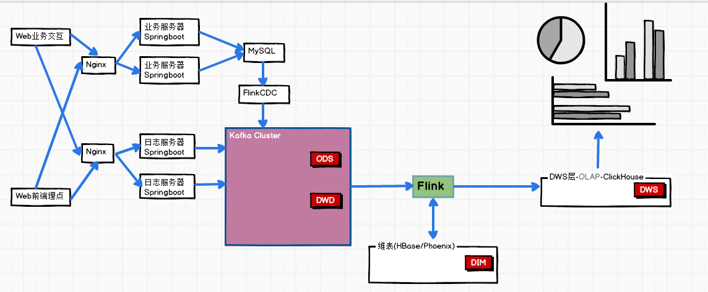
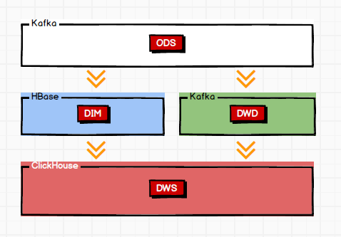
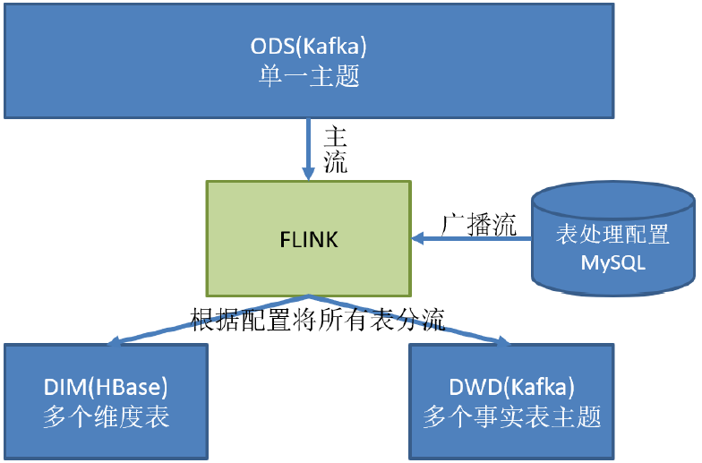
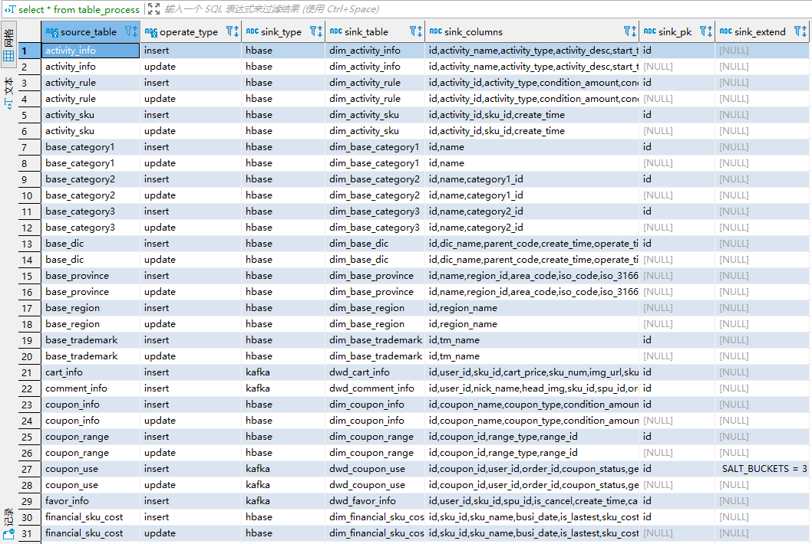
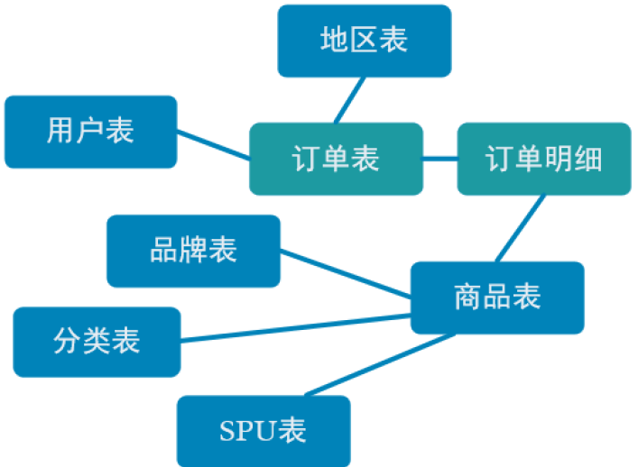

# 实时数仓-Flink


[TOC]


## 项目目的

​		曾经做过一个实时日志分析项目，但是指标固定、中间结果没有沉淀，导致如果想扩充指标、实现其他需求就要写重复代码，不利于实时数据的分析。(其他指标：如灵活选择TopN区间段、一次实时数据生成多个指标)

​		所以想做这样一个实时数仓项目，增加其数据的复用性、增加数据可以生成的指标、增加可分析维度。

​		普通实时计算和实时数仓相比的优势在于，在指标相对固定的情况下，一次数据就可以直接输出结果，**实时性更强**。


## 项目架构




## 实时数仓数据类型


### 数据库数据

> 业务交互数据: 业务流程中产生的登录、订单、用户、商品、支付等相关的数据，存储在MySQL中。


#### 自定义反序列化器

> FlinkCDC默认的反序列器 直接调用的对象的toString()方法，不利于后续处理。

- 将日志信息，转化为JSON对象后，在调用JSON的toString()方法

- ```json
  //封装的数据格式:json
  {
  "database":"",
  "tableName":"",
  "type":"c u d",
  "before":"{"":"","":""......}",
  "after":"{"":"","":""......}"
  }
  ```

- 时间戳用的是before和after里面的事件时间


### 日志数据

- 模拟日志生成的jar包，可以将日志发送给指定的端口 -> http://hadoop1:80/applog
- 应用服务的web访问端口是8081，指定kafka的代理地址是hadoop1:9092
- 生成的日志落盘(info)后，写入到kafka的 `ods_base_log`主题中，日志格式是json格式。
- 模拟日志采集程序写好后，打包放入集群。
- **两个jar包，一个日志生成jar包，将日志发送到`http://hadoop1:80/applog`，由nginx代理到三台日志服务器**
- **三台日志服务器，分别接收/applog请求，然后将日志落盘并写入kafka。**


#### Nginx

> engine x 高性能HTTP和反向代理服务器，占用内存少，并发能力强。


##### 正向代理与反向代理

- 正向代理：类似跳板机，代理访问外部资源。(跳板机取回google.com内容，返回给我)
- 反向代理：以代理服务器来**接收internet上的连接请求**，然后**将请求转发给内部网络上的服务器**，并将从服务器上得到的结果返回给internet上请求连接的客户端。


##### 负载均衡

- 集群中的每台都生成日志信息，请求由nginx平衡给每台服务器，实现负载均衡。
- 模拟数据发给nginx，由nginx转发给三台日志服务器。


#### 日志信息

> 项目用到的日志分为两类，页面埋点日志、启动日志


##### 埋点日志

> 埋点日志包含：
>
> ​						当前页面的页面信息
>
> ​						所有事件(动作)
>
> ​						所有曝光信息
>
> ​						所有错误信息
>
> ​						公共信息：设备信息，地理位置，应用信息 **common字段**


```json
{
  "common": {                  -- 公共信息
    "ar": "230000",              -- 地区编码
    "ba": "iPhone",              -- 手机品牌
    "ch": "Appstore",            -- 渠道
    "is_new": "1",--是否首日使用，首次使用的当日，该字段值为1，过了24:00，该字段置为0。
	"md": "iPhone 8",            -- 手机型号
    "mid": "YXfhjAYH6As2z9Iq", -- 设备id
    "os": "iOS 13.2.9",          -- 操作系统
    "uid": "485",                 -- 会员id
    "vc": "v2.1.134"             -- app版本号
  },
  "actions": [                     --动作(事件)  
    {"action_id": "favor_add",   --动作id
      "item": "3",                   --目标id
      "item_type": "sku_id",       --目标类型
      "ts": 1585744376605           --动作时间戳
    }
  ],
  "displays": [
    {
      "displayType": "query",        -- 曝光类型
      "item": "3",                     -- 曝光对象id
      "item_type": "sku_id",         -- 曝光对象类型
      "order": 1,                      --出现顺序
      "pos_id": 2                      --曝光位置
    },
    {
      "displayType": "promotion",
      "item": "6",
      "item_type": "sku_id",
      "order": 2, 
      "pos_id": 1
    },
    {
      "displayType": "promotion",
      "item": "9",
      "item_type": "sku_id",
      "order": 3, 
      "pos_id": 3
    },
    {
      "displayType": "recommend",
      "item": "6",
      "item_type": "sku_id",
      "order": 4, 
      "pos_id": 2
    },
    {
      "displayType": "query ",
      "item": "6",
      "item_type": "sku_id",
      "order": 5, 
      "pos_id": 1
    }
  ],
  "page": {                       --页面信息
    "during_time": 7648,        -- 持续时间毫秒
    "item": "3",                  -- 目标id
    "item_type": "sku_id",      -- 目标类型
    "last_page_id": "login",    -- 上页类型
    "page_id": "good_detail",   -- 页面ID
    "sourceType": "promotion"   -- 来源类型
  },
  "err":{                     --错误
	"error_code": "1234",      --错误码
    "msg": "***********"       --错误信息
  },
  "ts": 1585744374423  --跳入时间戳
}
```


##### 启动日志

> 启动日志结构相对简单，主要包含公共信息，启动信息和错误信息。


```json
{
  "common": {
    "ar": "370000",
    "ba": "Honor",
    "ch": "wandoujia",
    "is_new": "1",
    "md": "Honor 20s",
    "mid": "eQF5boERMJFOujcp",
    "os": "Android 11.0",
    "uid": "76",
    "vc": "v2.1.134"
  },
  "start": {   
    "entry": "icon",         --icon手机图标  notice 通知   install 安装后启动
    "loading_time": 18803,  --启动加载时间
    "open_ad_id": 7,        --广告页ID
    "open_ad_ms": 3449,    -- 广告总共播放时间
    "open_ad_skip_ms": 1989   --  用户跳过广告时点
  },
  "err":{                     --错误
	"error_code": "1234",      --错误码
    "msg": "***********"       --错误信息
  },
  "ts": 1585744304000
}
```


## 分层需求 & 每层职能


- 数据走向




- 每层职能

| 分层 | 数据描述                                                     | 生成计算工具         | 存储媒介   |
| ---- | ------------------------------------------------------------ | -------------------- | ---------- |
| ODS  | 原始数据，日志和业务数据                                     | 日志服务器，FlinkCDC | kafka      |
| DWD  | 数据分流，UV,跳出行为，订单宽表，支付款表                    | Flink                | kafka      |
| DIM  | 维度数据                                                     | Flink                | HBase      |
| DWS  | 根据**维度主题**将多个**事实数据轻度聚合**，形成**主题宽表** | Flink                | ClickHouse |
| ADS  | ClickHouse数据进行筛选聚合。                                 | ClickHouse、SQL      | 可视化展示 |


## ODS层

- 日志数据
  - 模拟日志生成的jar包，可以将日志发送给指定的端口 -> http://hadoop1:80/applog
  - **两个jar包，一个日志生成jar包，将日志发送到`http://hadoop1:80/applog`，由nginx代理到三台日志服务器**
  - **三台日志服务器，分别接收/applog请求，然后将日志落盘并写入kafka  `ods_base_log`  主题**
- 业务数据
  - FlinkCDC 读取 业务库的变化后，直接写入kafka的  `ods_base_db`  主题


## DWD层

### BaseLogApp

- 读取  `ods_base_log`  主题数据

  - 过滤脏数据：如果解析不出来 `JSONObject`  则滤除
  - 利用侧输出流分流，分离出`启动日志`，`页面日志`, `曝光日志`
    - 启动日志：`start`字段
    - 曝光日志：从 埋点日志中取出 `display`字段， 并将页面日志中的 `page_id` 字段添加到曝光日志中
    - 页面日志：非启动日志，即页面日志，直接主流输出
- 分别写入kafka主题
    - `dwd_start_log`
    - `dwd_display_log`
    - `dwd_page_log`

  

### BaseDBApp


> - 业务数据的变化，可以通过`FlinkCDC`采集到，但是只输出到一个`Topic`中。
>   - 这些数据既包含 `事实数据` 又包含 `维度数据` ,输出到一个`Topic`不利于后续处理。
>   - 所以从`kafka`读取数据后，将维度数据保存到`HBase`，事实数据写回到`kafka`作为业务数据的`DWD层`
> - `FlinkCDC `读取到的表，每个表有不同的特点，有的是维度表，有的是事实表。
>   - 当表很多时，为每一张表写一个配置，代码量很大；
>   - 当业务端随着需求变化，增加表时，就需要修改配置重启计算程序。
>   - 需要实现 **`动态分流`** 功能，将配置信息以`MySQL`表的形式存储起来，利用 `FlinkCDC `去读取这张配置表形成配置流，并将其作为 **`广播流`** 与主流连接。
>
> 
>
> - 配置表
>
>   - ```shell
>     #配置表字段
>     source_table
>     operate_type
>     sink_type
>     sink_table
>     sink_columns  HBase建表用
>     sink_pk       Phoenix建表用  (kafka会自动创建主题，Phoenix只能提前创建好)
>     sink_extend	  扩展字段，说明是否做预分区
>     ```
>
>   - 配置表示例
>
>     - 
>
>   - 当业务端增加表时，只需要在配置表中增加一条表信息即可。
>


- 读取  `ods_base_db`  主题数据

- `FlinkCDC`读取 `MySQL配置表` ->`tableProcessDS`

  - 将`tableProcessDS`转换为`广播`流
    - 广播流需要一个`Map状态`作为输入参数，`key` 为表名+操作类型，`value`为整行数据。
    - 就是将配置信息，写入`Map状态`中，留给其他流使用
  - 连接`广播流`和 `ods_base_db `主流
    - 广播流：
      - 配置表一般只有新增，读取的`json`类型中，`after`字段一定有值
      - 读取数据，检查`HBase`表是否存在，如果不存在则在`Phoenix`中建表
      - 写入状态,广播出去
    - 主流：
      - 通过`表名-操作类型`获取广播的配置数据
      - 过滤数据  根据 `sink columns` 过滤数据，数据库表中的有些字段于我们是无用的
      - 将`sink table` 写入`json`对象，通过`sink_type`分流

- `Sink`

  - 主流数据写入`kafka`，根据数据的`sinkTable`字段，决定写入的主题
  - 维表数据写入`Phoenix`

  

### UV计算

> 也称为`DAU`(Daily Active User) 日活用户

- 读取 `dwd_page_log` 数据
- 按 `mid` key by
- 用`Value State` 存上次登录时间，做去重
    - 如果数据的 `last_page_id` 可以取到，那么不是`UV`，这条数据被过滤掉
    - 如果取不到，表明没有上一跳
        - 如果`Value State` 取的值为`null`，更新其值，留下该条数据。
        - 如果`Value State` 取的值不为`null`，说明不是`UV`，滤除数据。


### 跳出明细计算

> `跳出`就是用户成功访问了网站的一个页面后就退出，不再继续访问网站的其他页面。
>
> `跳出率`就是`跳出次数 / 访问次数`
>
> 关注跳出率 ，可以看到引流过来的访客是否能很快地被吸引，取到引流过来的用户之间的质量对比。


> > **思路**：跳出即表明这次数据是`单跳`，没有上一跳，是从别处引流过来的。
> >
> > 如果这条数据后一段时间内没有访问其他页面，即视为跳出。


> > > `会话窗口`  **VS**  `Flink CEP`
> > >
> > > A, B, C分别代表一次单跳，字母之间的短杠数代表秒数，假设挑出时间阈值为10S
> > >
> > > 最后聚合的时候，窗口内只有一条数据的，为跳出数据。
> > >
> > > A - - - B - - - - - - - - - - - - -C
> > >
> > > 10s内的会话窗口 有A和B两条跳出数据，但是会话窗口规定一条数据，这两条就都不算了。
> > >
> > > 会话窗口会明显地丢数据。


- 读取 `kafka ``dwd_page_log` 主题数据
    - 设置乱序流水位线，`1s`延时，事件时间指定为数据中的 "`ts`"字段
- 定义`CEP` 模式序列
    - 第一个事件：上一跳 `last_page_id`  为`null`
    - 第二个事件：上一跳 `last_page_id` 为`null`， 且匹配时间为`10s`(事件时间)
        - (第一个事件表明当前可能是跳出，第二个时间表明它确实是跳出，且控制了时间)
- 将`CEP`作用到流(`keyed Stream`)上
    - 提取匹配上的数据和超时数据
        - 超时数据(第一条来了，第二条超时了没来)，提取第一条。
            - 超时数据利用侧输出流接收
        - 匹配上数据(两条都来了)，提取第一条
    - 将两个流Union在一起
- 写入`kafka`  `dwm_user_jump_detail `主题


### 订单宽表

> 围绕订单有很多维度统计需求：用户、地区、商品、品类、品牌等等。
>
> 为了统计计算方便，减少大表之间的关联，将围绕订单的相关数据整合成宽表。
>
> 
>
> 
>
> - 事实数据和事实数据关联：订单表、订单明细表两个流之间的join
> - 事实数据和维度数据关联：在流计算中查询维表，补充字段。
> - 双流join
>     - 滚动窗口join：窗口内两条流的所有排列组合方式
>     - 滑动窗口join：类似滚动窗口，不过一条数据可能属于不同窗口，会输出多次
>     - 会话窗口join：会话窗口时间不对齐，在设置了`gap`时，必须两个流同时满足超时时间才可以join
>     - Interval join：**不需要开窗**，a join b 就是在a流的每一个元素开一个范围，和范围中的b流元素join
>         - 在当前元素时间点前和后的数据 通过保存下来，然后和当前元素join
> - 关联维表
>     - 关联维表即通过主键的查询，HBase的查询速度不及流之间的join，外部数据源的查询通常是流式计算的性能瓶颈。
>     - 优化策略：
>         - 旁路缓存：任何请求优先访问缓存，未命中再去查询数据库，同时把结果写入缓存。(用Redis实现)
>             - 缓存要设置过期时间，不然冷数据会常驻缓存浪费资源。
>             - 要考虑维度数据是否会发生变化，发生变化要主动清除缓存。
>         - 异步查询：默认情况下MapFunction，单个并行只能用同步方式去交互(将请求发给外部存储，IO阻塞，等待请求)。可以增加并行度，但是浪费资源。
>             - 可以利用异步IO，单个并行可以连续发送多个请求，哪个先返回就先处理哪个，从而连续的请求之间，不需要阻塞式等待，提高了效率。
>             - 异步查询是把维表查询托管给单独的线程池完成。


- 读取两张事实表的流  `dwd_order_info`  和  `dwd_order_detail`
    - 设置升序水位线，提取 `create_ts` 作为水印。
    - `双流join`成没有维度信息的流
        - 用的order_info 表 join order_detail 表
        - 两个流分别key by (order_id)，一定要做key by 就相当于表的联结条件
        - interval join 前5s 后5s
- 关联维表 
    - 使用异步查询加速查询速度
    - 使用模板设计模式，让调用类去重写方法(getKey, join)
    - 关联 `用户`、`地区`、`SKU`、`SPU`、`品牌`、`品类` 维度
- 形成订单宽表，写出到 kafka `dwm_order_wide` 主题


### 支付宽表

> 支付表没有订单明细，支付金额没有细分到商品，没有办法统计商品级的支付情况
>
> 支付宽表 核心就是把支付表信息与订单宽表关联。


- 读取`kafka`  `dwd_payment_info` 主题 和 `dwm_order_wide` 主题
    - 提取时间戳 生成水印
    - 双流`join interval (-15mins, 0)`
    - 形成支付宽表，写入`kafka`主题 `dwm_payment_wide`


## DIM层

> 由`DWD`层的`BaseDBAPP`中 读取数据写入维表。


## DWS层

> 定位：轻度聚合，因为DWS要应对很多实时查询，如果是完全明细那么查询的压力是非常大的。
>
> 将更多的实时数据以主题的方式组合起来便于管理，同时也能减少维度查询的次数。


### 访客主题宽表

> 这张宽表就是：维度+事实数据
>
> - 事实数据：PV，UV，跳出次数，进入页面数(session_count)，连续访问时长
> - 维度数据：渠道，地区，版本，新老用户进行聚合
>


- 读取 `kafka dwd_page_log(pv)` 主题  `dwm_unique_visit` 主题   `dwm_user_jump_detail` 主题
  - 处理成同样的`bean`，`union`三个流
    - 从`pv`主题 获得 访问人数、访问页面数(如果`last_page_id`为null 为1，否则为0）、停留时间
    - 从`uj`主题获得跳出人数
    - 从`uv`主题获得独立访问人数
    - 维度信息，分别从各自流的json对象中获得
  - 提取`ts`为时间戳，水印延迟`11s`
    - 因为`user_jump`的计算给了`1s`的水印延迟，而且`uj`计算要最长等待`10s`做出判断。
    - 由`dwd_page_log`计算`user_jump`，访客主题宽表又要用到`dwd_page_log`和`user_jump`两个流，当访客宽表给了`10s`的窗口，不延迟水印的话，等到`user_jump`计算出来，窗口早就关闭了。
    - 由于`user_jump`的计算特性，不得已延迟，降低时效性。
  - 按地区、渠道、品类、新老用户四个维度` key by`
    - 开`10s`的滚动窗口聚合(大屏刷新时间是`10s`)
    - 聚合采用`ReduceFunction `传入重写的`reduce`方法和`window`方法，用`reduce`增量聚合；最后由`window`方法全量聚合，全量聚合时不需要缓存全部状态。
    - `window()`可以获得窗口的开始时间和关闭时间，将这两个维度写入数据流的`stt`和`edt`中
  - 将主题宽表写入`ClickHouse`


### 商品主题宽表

> - 事实数据：
>   - `dwd_page_log `                    pv流  -> 点击 曝光
>   - `dwd_favor_info`                favor流 -> 收藏
>   - `dwd_cart_info`                  cart流 -> 加入购物车
>   - `dwm_order_wide`                order流-> 下单
>   - `dwm_payment_wide`            pay流 -> 支付
>   - `dwd_order_refund_info`   refund流 -> 退款
>   - `dwd_comment_info`              comment流->评价
>
> - 维度数据：去`HBase`查
> - 由于`Bean`字段太多，这里用`建造者模式`。


- 读取`7`个流，转成统一格式，`union`
  - 提取时间戳，给`2s`的水印延时
  - 按`sku_id`分组
  - 分组开窗聚合，按`sku_id`分组，开`10s`的滚动窗口，(`reduce`传`window `增量聚合 + 全量聚合提供窗口信息)
- 先聚合再关联可以减少查询`Phoenix`的次数
- 关联维度信息
  - 异步查询
- 将数据写入`ClickHouse`，形成商品主题宽表


### 地图主题宽表

> 地区主题反映各个地区的销售情况，轻度聚合之后保存。

- 创建环境和表环境

  - 读取`dwm_order_wide`主题

  - 使用`DDL`创建表，提取时间戳生成水印

  - 分组开窗聚合，求订单数量和订单金额
  
- 将动态表转换为流

  - 追加流

- 写入`ClickHouse`，形成地区主题宽表


### 关键词主题宽表

> 服务于大屏的字符云，数据来源是用户在搜索栏的搜索，另外就是以商品为主题的统计中获取关键词。
>
> 搜索栏分词器：IK
>
> 分词是炸裂函数，这里要自定义UDTF

- 表环境

  - 读取 `kafka `主题 `dwd_page_log` 
  - 通过ddl转换为表
  - 过滤数据，`last_page_id` 为 `search` 并且搜索词 `is not null`

- 注册UDTF函数，分词

  - ```java
    tableEnv.createTemporySystemFunction("split_words", SplitFunction.class);
    select word, rt from fullWordTable, lateral table(split_words(full_word));
    ```

  - lateral 用法和 Hive很像，搭配炸裂函数，一行变多行

- 分组开窗聚合

  - 按词分组，开10s滚动窗口

- 表转流

  - 追加流

- 写入ClickHouse

